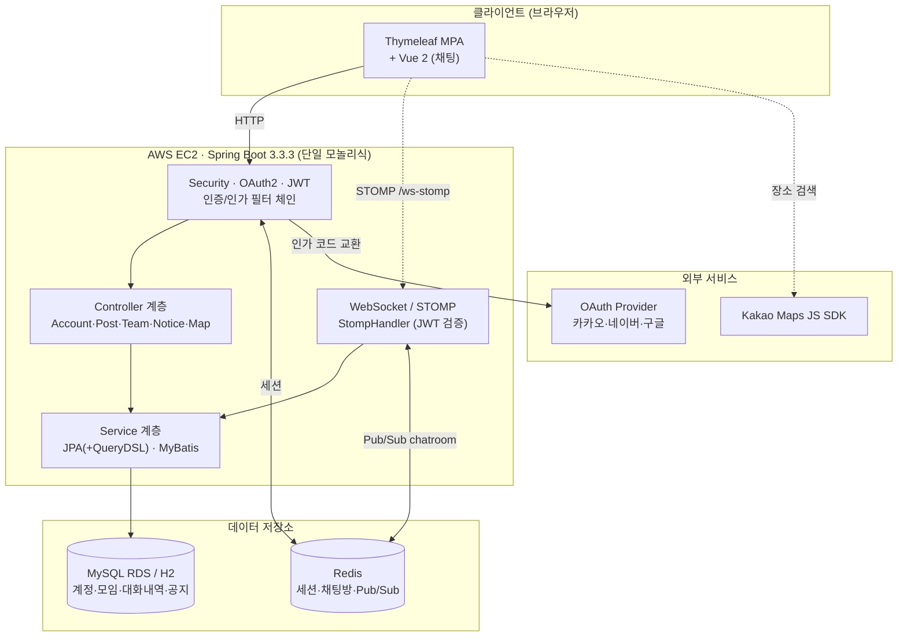

# EatMate — 실시간 채팅·지도 기반 식사 모임 매칭 서비스

<p align="center">
  
</p>

> 혼자 먹기 싫은 사람들을 위한 **식사 모임 매칭 플랫폼**.
> 사용자가 모임 게시글을 올리고 → 다른 사용자가 참여하면 → **모임 전용 실시간 채팅방**이 열리고 → **카카오맵**으로 만날 장소를 정하는 흐름을 하나의 Spring Boot 애플리케이션으로 구현했습니다.

<p align="center">
  
  
  
  
</p>

---

## 프로젝트 개요

OAuth 소셜 로그인으로 진입한 사용자가 **식사 모임을 만들고 참여**하며, 모임이 결성되면 **WebSocket(STOMP) + Redis Pub/Sub 기반 실시간 채팅방**에서 소통하고, **카카오맵 SDK**로 약속 장소를 검색·지정하는 온라인 매칭 서비스입니다.

**단일 서버 모놀리식**으로 구성했으며, 하나의 애플리케이션 안에서 인증(OAuth2 + JWT) · 모임 도메인 · 실시간 채팅 · 지도 · 공지의 계층형 아키텍처를 다루는 데 초점을 맞췄습니다. 데이터 접근은 **JPA(+QueryDSL)를 주력**으로 하되 계정 도메인 일부에 MyBatis를 병행하는 하이브리드 구조입니다.

---

## 기술 스택

| 구분 | 기술 | 역할 |
|---|---|---|
| **Language / Framework** | Java 17, Spring Boot 3.3.3 | 단일 모놀리식 서버 (계층형 아키텍처) |
| **Real-time** | Spring WebSocket + STOMP, Redis Pub/Sub | 채팅 메시지 전달. Pub/Sub은 **다중 인스턴스 간 전파** 담당 |
| **In-Memory** | Redis (Lettuce) | ① 세션 스토어(운영) ② **방 진입 캐시**(최신 메시지·멤버십) ③ 채팅방 메타데이터 ④ 세션↔방 매핑 ⑤ 접속자 수 ⑥ Pub/Sub 채널 |
| **Database** | MySQL 8 (AWS RDS) / H2 (로컬 TCP) | 계정 · 모임 · 채팅방 · **대화 내역** · 공지 |
| **ORM / Query** | Spring Data JPA, QueryDSL 5.0, MyBatis 3.0 | JPA 주력 + 동적 검색(QueryDSL) + 계정 도메인 MyBatis 병행 |
| **Auth** | Spring Security, OAuth2 Client, JWT (jjwt 0.11.5) | 소셜 로그인 3종 후 JWT 발급, STOMP CONNECT 시 검증 |
| **Map** | Kakao Maps JS SDK | 키워드 장소 검색 · 마커 렌더링 · 좌표 수집 |
| **View** | Thymeleaf (+Layout Dialect) + Vue 2 | 서버 사이드 렌더링(MPA) + 채팅 화면 Vue |
| **Monitoring** | Actuator, Micrometer, Prometheus | 헬스체크 및 메트릭 노출 |
| **Test** | JUnit 5, Mockito, Spring Security Test | **46건** — 저장소 · 서비스 · 컨트롤러 슬라이스 |

---

## 주요 기능

### 1. 인증 및 보안
- **OAuth 2.0 소셜 로그인 3종** (카카오 · 네이버 · 구글) — `CustomOAuth2UserService`가 provider별 응답 구조를 정규화하고, 최초 로그인 시 계정을 자동 생성합니다.
- **WebSocket 구간 JWT 인증** — STOMP CONNECT 시 토큰을 검증하고, 메시지 발행 시 **토큰에서 발신자를 확정**합니다. 클라이언트가 보낸 발신자 정보는 신뢰하지 않습니다.

### 2. 모임 관리
- **게시글 작성 = 모임 + 채팅방 동시 생성** — `Team` 엔티티와 1:1로 연결된 `ChatRoom`이 함께 만들어지고, 작성자가 개설자로 등록됩니다.
- **참여 / 탈퇴 / 강퇴** — `AccountTeam` 조인 엔티티로 멤버십을 관리합니다. 중복 참여는 서비스 계층에서 차단합니다.
- **검색** — 모임명 · 장소명 · 주소로 페이징 검색.

### 3. 실시간 채팅 + 대화 내역 영속화
- 모임이 결성되면 전용 채팅방이 열리고, 아래 경로로 메시지를 전달합니다.
- **대화가 RDBMS에 영구 보관**되어 재접속 · 새로고침 · 서버 재시작 후에도 유지됩니다.
- 채팅방 진입 시 최근 50건을 불러오고, **위로 스크롤하면 커서 기반으로 이전 대화를 이어서** 불러옵니다.

```
[Vue 클라이언트] --STOMP CONNECT/SUBSCRIBE/SEND--> [StompHandler] --JWT 검증
        │ /pub/chat/message
        ▼
[ChatService.sendChatMessage()]
        ├─ (TALK) chatMessageRepository.save()     ← RDBMS 동기 영속화
        └─ redisTemplate.convertAndSend()          ← Redis Pub/Sub "chatroom"
                 │
                 ▼  (모든 인스턴스가 수신)
        [RedisSubscriber.sendMessage()] --SimpMessagingTemplate--> /sub/chat/room/{roomId}
                 │
                 ▼
        [해당 인스턴스에 연결된 구독자]
```

### 4. 지도 통합
- 카카오 Maps JS SDK로 **키워드 장소 검색 · 마커 렌더링 · 현재 위치 기준 초기 중심좌표**를 제공합니다.
- 검색 결과의 장소명 · 주소 · 좌표 · 전화번호를 `Team` 엔티티에 매핑해 약속 장소를 모임에 종속시킵니다.

### 5. 공지
- 관리자(`ROLE_ADMIN`) 전용 CRUD, QueryDSL 기반 동적 검색 + DTO 프로젝션 페이징.

---

## 기술적 판단과 근거

포트폴리오 관점에서 **왜 그렇게 만들었는지**를 정리합니다. 상세 검증 데이터는 [작업 기록](docs/worklog-2026-08.md)에 있습니다.

### 대화 내역 영속화 — 저장 지점을 발행부에 둔 이유

메시지 저장 위치는 두 곳이 후보였습니다.

| 위치 | 결과 |
|---|---|
| `RedisSubscriber` (수신부) | Pub/Sub이 **모든 인스턴스**에 전달하므로 서버 N대에서 같은 메시지가 **N번 저장**됨 |
| `ChatService` (발행부) | 메시지당 **정확히 1회** 실행 |

발행부를 선택했습니다. 또한 `@Transactional`로 묶어 **저장 실패 시 발행도 중단**되게 했습니다. 화면에는 보이는데 내역에는 없는 메시지를 만들지 않기 위해 정합성을 우선한 선택입니다.

동기 INSERT를 택한 근거는 다음과 같습니다. 비동기는 서버 다운 시 버퍼가 유실되고, Redis 버퍼링은 조회가 "아직 내려가지 않은 분량 + DB 분량"에 걸쳐 **커서 페이징이 두 데이터 소스로 쪼개집니다**. 병목으로 측정된 바가 없는 상태에서 도입하면 얻는 것보다 잃는 것이 큽니다.

### 커서 기반 페이징 — `Page` 대신 `List`를 쓴 이유

```java
@Query("select m from ChatMessage m left join fetch m.sender " +
       "where m.chatRoom.roomId = :roomId and m.id < :beforeId " +
       "order by m.id desc")
List<ChatMessage> findByRoomIdBefore(...);
```

- **정렬 키는 `id`** — `createdAt`은 같은 밀리초에 여러 건이 들어올 수 있어 커서로 부적합합니다.
- **`(room_id, chat_message_id)` 복합 인덱스** — 커서 쿼리가 인덱스만으로 처리됩니다.
- **`Page` 대신 `List` + `Pageable`** — `Page`는 매 요청마다 `count(*)`를 추가로 실행합니다. 채팅 내역에 전체 건수는 필요 없고, `size+1`건을 조회해 다음 페이지 존재 여부를 판정하면 충분합니다.
- **경계는 배타적(`<`)** — `<=`로 두면 페이지마다 1건씩 중복됩니다.

실사용 234건으로 경계를 검증했습니다.

```
page1: ID 234..185  50건  hasMore=true   page4: ID 84..35  50건  hasMore=true
page2: ID 184..135  50건  hasMore=true   page5: ID 34..1   34건  hasMore=false
page3: ID 134..85   50건  hasMore=true   합계 234건 — 중복·누락 0
```

### 설정 프로필 분리

단일 `application.yml` 안에서 `---` 문서 겹침으로 환경을 나누던 구조를 **공통 / dev / prod 3파일로 분리**했습니다. 기존 구조는 브랜치마다 같은 파일이 다르게 진화해 병합 충돌이 반복됐고, 운영 문서가 기본 문서 위에 얹히면서 **개발용 설정이 운영으로 새는** 문제도 있었습니다.

분리 후 원본과 프로퍼티 단위로 대조해 동작 동등성을 확인했습니다(dev 차이 0건, prod 차이 4건 — 모두 바인딩되지 않는 죽은 키).

---

## 아키텍처



### 계층 구조

```
Config (Security / DB / WebSocket / Redis / QueryDSL)
   │
Security · OAuth2 · JWT ── 인증/인가 필터 체인
   │
Controller (Account · Post · Team · Chat · Notice · Map)
   │
Service ── ChatService(쓰기) / ChatHistoryService(읽기) 분리
   │        JPA 주력 + 계정 도메인 MyBatis 병행
DAO ── ┌ JPA Repository (+ QueryDSL: Team · Notice · ChatMessage)
        └ MyBatis @Mapper (Account · AccountTeam)
   │
DataSource ── H2(로컬 TCP) / MySQL(운영 RDS)  ·  Redis
```

- **JPA + MyBatis 하이브리드**: `DBConfig`가 하나의 `DataSource`를 공유하며 둘을 동시에 구성합니다. 신규 기능은 JPA(+QueryDSL) 우선.
- **채팅 도메인 읽기/쓰기 분리**: 인가 검증과 커서 계산이 붙으면서 한 클래스가 과하게 커져 `ChatService`(발행·영속화)와 `ChatHistoryService`(조회·인가)로 나눴습니다.

### 도메인 모델

```
Account ──< AccountTeam >── Team ──1:1── ChatRoom ──< ChatMessage
   │                                       (UUID PK)      (커서 페이징)
   └──< Notice
```

| 엔티티 | 설명 |
|---|---|
| `Account` | 사용자 계정 (`email` · `oauth2_id` unique, `provider` · `roles`) |
| `Team` | 식사 모임. 지도 필드(`placeName` · `addressName` · `x` · `y` 등) 포함, `BaseTimeEntity` 상속 |
| `AccountTeam` | 계정↔모임 조인 엔티티 (`isLeader` 개설자 여부) |
| `ChatRoom` | 모임과 1:1, UUID 문자열 PK |
| `ChatMessage` | 대화 내역. `sender_name` 스냅샷 보존, 인덱스 `(room_id, chat_message_id)` |
| `Notice` | 관리자 공지 (`title` 인덱스, `content` TEXT) |

`ChatMessage.sender`는 nullable입니다. 계정이 삭제돼도 메시지는 남아야 하며, 표시 이름은 **발신 시점 스냅샷**으로 별도 보존해 닉네임 변경 시에도 과거 대화의 발신자가 바뀌지 않습니다.

---

## 테스트

외부 의존(H2 서버 · Redis · 환경변수) 없이 실행되는 슬라이스 테스트 **46건**입니다.

```bash
./gradlew test
```

| 계층 | 방식 | 건수 | 중점 |
|---|---|---|---|
| 저장소 | `@DataJpaTest` | 6 | 커서 경계(중복·누락), 방 격리, `hasMore` 판정 |
| `ChatCacheRepository` | Mockito | 10 | **Redis 장애 격리**, LPUSHX 조건부 갱신, 통째 교체 |
| `ChatService` | Mockito | 8 | TALK만 저장, 저장 실패 시 발행 차단, 캐시 반영 |
| `ChatHistoryService` | Mockito | 17 | 커서 · 정렬 반전 · size 클램프 · 인가 · 캐시 히트/미스 |
| 컨트롤러 | `@WebMvcTest` | 4 | 응답 JSON, 파라미터 바인딩, 403 |
| 컨텍스트 | `@SpringBootTest` | 1 | 기동 |

자동 테스트는 현재 **채팅 도메인에 집중**되어 있습니다. 계정 · 모임 · 공지 도메인은 자동 검증이 없으며, 이는 [알려진 이슈](docs/known-issues.md)에 기록해 두었습니다.

---

## 로컬 실행

**사전 요구사항**: JDK 17, Docker(또는 Redis), H2 실행 파일

```bash
# 1) Redis
docker run -d --name eatmate-redis -p 6379:6379 redis

# 2) H2 TCP 서버 — -ifNotExists 필수 (H2 2.x는 없으면 원격 DB 생성을 거부)
java -cp <h2.jar> org.h2.tools.Server -tcp -ifNotExists -web

# 3) 애플리케이션
./gradlew bootRun
```

환경변수 없이 `dev` 프로필로 기동합니다. 소셜 로그인과 지도를 사용하려면 실제 키가 필요하며, **`config/application.yml`**(gitignore 대상)에 넣으면 클래스패스 설정보다 우선 적용됩니다.

```yaml
# config/application.yml — 이 파일은 커밋되지 않습니다
kakao:
  client:
    id: 발급받은_REST_API_키
    secret: 발급받은_Client_Secret
```

운영 프로필은 `SPRING_PROFILES_ACTIVE=prod`와 함께 `DB_URL` · `DB_USERNAME` · `DB_PASSWORD` · `REDIS_HOST` · `JWT_SECRET` · OAuth 키 6종을 환경변수로 요구합니다.

---

## 문서

| 문서 | 내용 |
|---|---|
| [요구사항 명세](docs/requirements.md) | 사용자 관점 요구사항 14건과 인수 기준 |
| [시스템 명세](docs/architecture.md) | 구성 요소 · 데이터 모델 · Redis 사용 · 인증/인가 · 비기능 요구사항 |
| [API 명세](docs/api.md) | HTTP 엔드포인트 41건 + STOMP 채널 3건 |
| [알려진 이슈](docs/known-issues.md) | 식별된 결함 12건과 조치 우선순위 |
| [작업 기록](docs/worklog-2026-08.md) | 2026-08 채팅 영속화 및 설정 분리 작업 |

> 문서는 완성된 코드를 정독해 역으로 정리한 **as-built 명세**입니다. 각 요구사항에 실제 구현 상태를 함께 표기했으며, 미충족 항목도 숨기지 않고 기록했습니다.

---

## 개발자

| 이름 | GitHub |
|---|---|
| 구본우 | [@BonuKoo](https://github.com/BonuKoo) |
